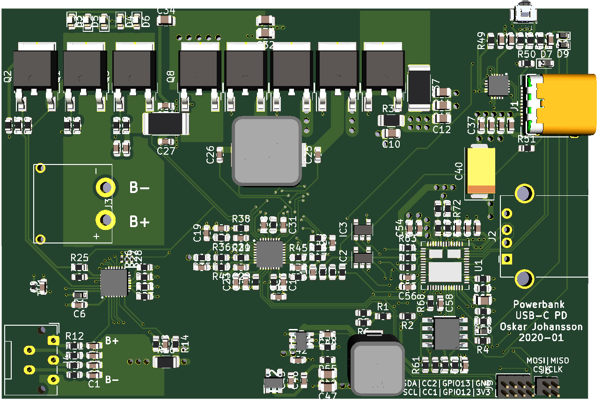
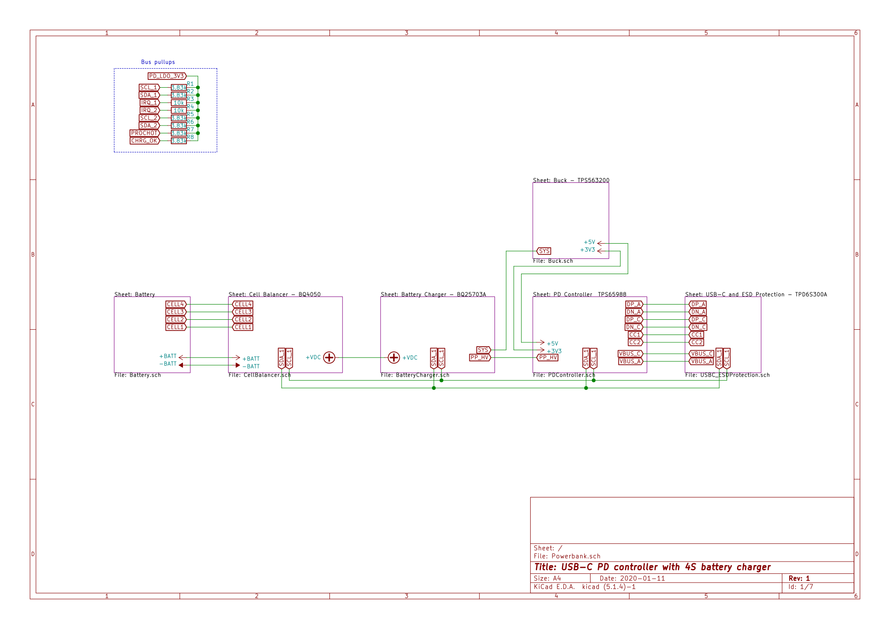
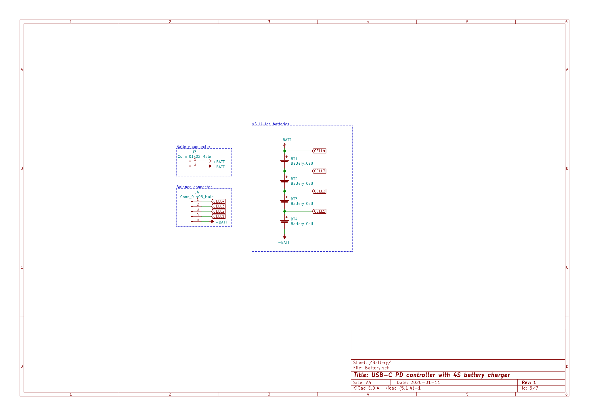
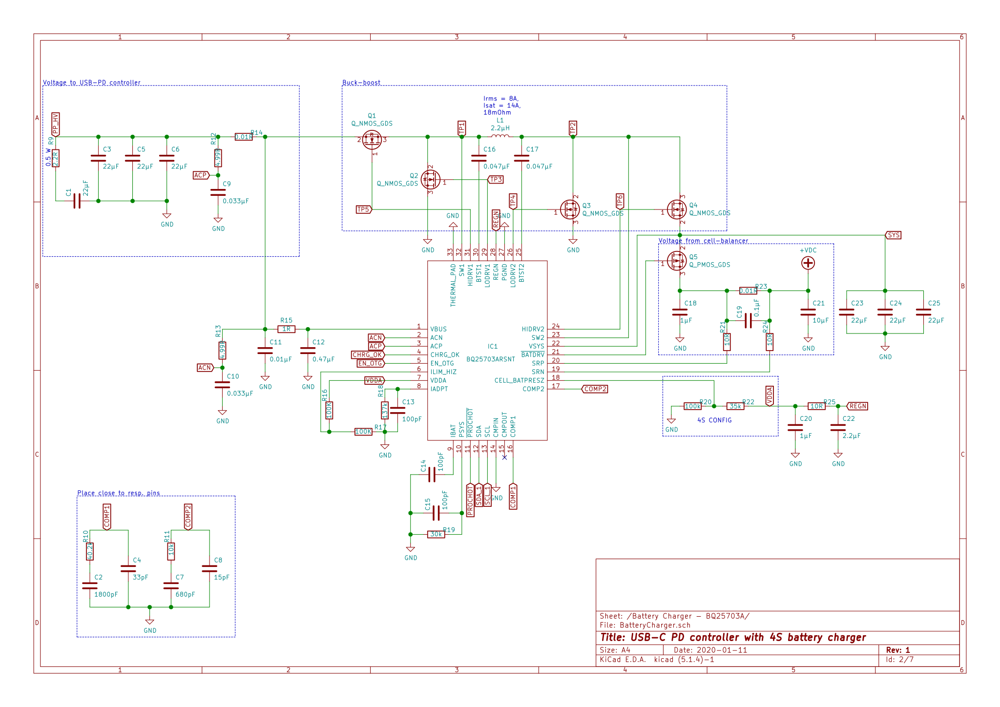
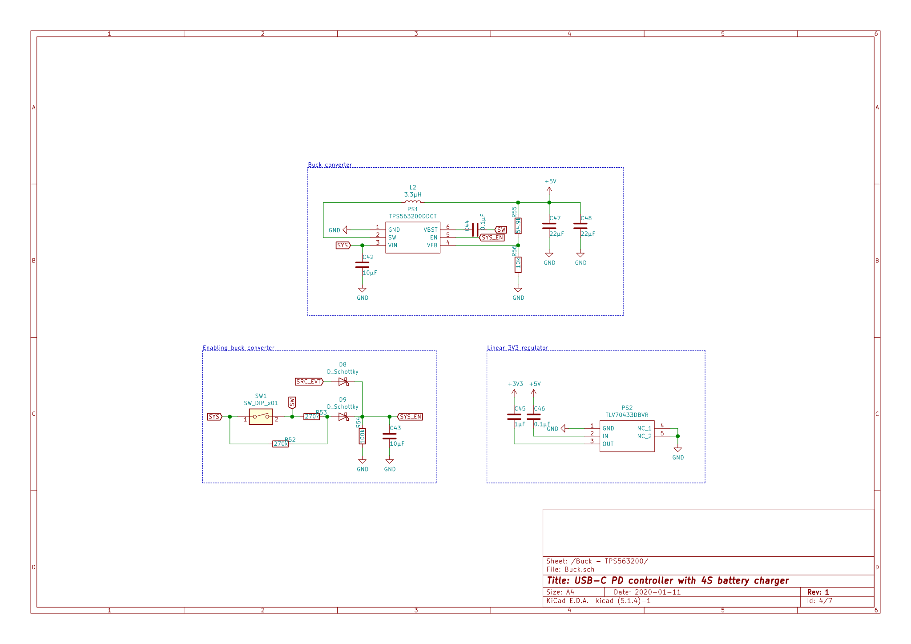

# Powerbank 4S
A powerbank to primarily use with MDP-XP Modular Power Supply. It can be found [here](https://www.welectron.com/Miniware-MDP-XP-Modular-Power-Supply). Though, the MDP-XP doesn't support PD, but only QC, so it won't be compatible. 

## Background 
One of the problems when using li-ion batteries is the charging, without a proper charger the cells wil be damages and probably start a fire. To remove these problems one solution would be a BMS with USB-C as a charging and discharging port. This doesn't exist yet, so someone has to make it. I also want to use it with both the powersupply and to charge my laptop using USB-C. 

## Specification
- 4S high power Li-ion 
- Charge with USB-C
- Discharge with USB-C

### Extra 
- Able to charge computer from powerbank
- An extra USB-A port for charging phones without USB-C. 

# Schematic and PCB

## PCB

## Schematic 

# Useful links
- [Design your USB-C PD Device](https://www.electronicproducts.com/Analog_Mixed_Signal_ICs/Power_Management/Design_your_next_USB_Type_C_USB_PD_device_with_buck_boost_battery_chargers.aspx) 
- [Dual port USB Type-C Power Delivery Powerbank Reference Design](http://www.ti.com/lit/ug/tidude8/tidude8.pdf)

